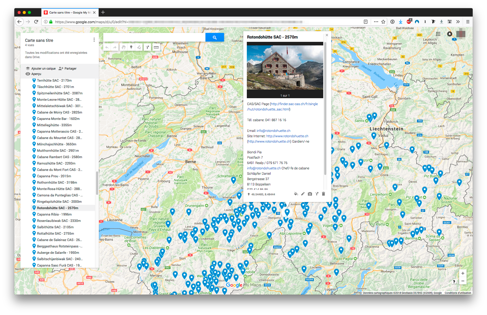

# CAS/SAC Cabin KML



This small application will scrape the official [Swiss Alpin Club](http://www.sac-cas.ch/) website and render a fully usable **KML file of all the cabins** to import on any map maker like Google Map or Google Earth.

## Use the demo

Instead of building the project, you can simply use the following steps :
1. [Download](https://github.com/Yago/cas-sac-cabins/archive/master.zip) the project
2. Use the `demo.kml` file

## Building the project

Clone the repo somewhere and :

```bash
$ npm install
$ npm run start
```

And open the given URL in your browser (may take some times before download prompt).
